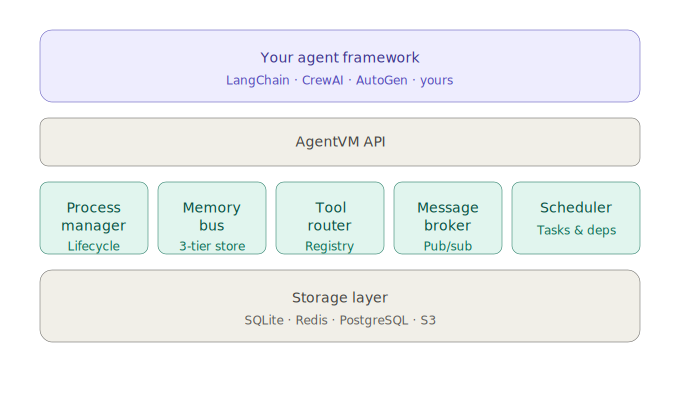

<div align="center">

# 🔩 AgentVM

### The Runtime Your AI Agents Deserve

**Process management · Memory bus · Tool routing · Message passing · Scheduling**

[](LICENSE)
[]()
[]()
[]()
[]()

[Documentation](./docs) · [Quick Start](#quick-start) · [Roadmap](#roadmap) · [Contributing](CONTRIBUTING.md) · [Discord]()

</div>

---

## The Problem

Every AI agent framework reinvents the same infrastructure: process lifecycle, memory, tool routing, scheduling, inter-agent messaging. The result? Shallow implementations, incompatible ecosystems, and wasted effort.

**AgentVM fixes this.** It's the shared runtime layer that sits *beneath* agent frameworks — handling the OS-level concerns so framework developers can focus on what matters: reasoning, planning, and workflow design.

> Think of it this way: LangChain, CrewAI, and AutoGen are applications. AgentVM is their operating system.

---

## Why AgentVM?

| Without AgentVM | With AgentVM |
|---|---|
| Every framework builds its own process model | Shared, battle-tested process lifecycle |
| Memory is an afterthought (chat buffers) | First-class memory bus with pluggable backends |
| Tools are framework-specific | Universal tool registry with permissions |
| No inter-agent communication standard | Built-in message broker (pub/sub + direct) |
| Debugging is guesswork | Structured events for full observability |
| Agents crash with no recovery | Checkpointing and automatic crash recovery |

---

## Architecture



### Core Modules

**🔄 Process Manager** — Spawn, pause, resume, and terminate agent processes. Each agent runs as an isolated unit with its own lifecycle, resource limits, and crash recovery.

**🧠 Memory Bus** — Shared memory subsystem with working (short-term), persistent (long-term), and shared (cross-agent) tiers. Pluggable storage backends.

**🔧 Tool Router** — Central registry for tools with automatic discovery, permission enforcement, rate limiting, and sandboxed execution.

**📨 Message Broker** — Pub/sub and direct channels for inter-agent communication. Typed messages, priority queues, and dead-letter handling.

**📅 Scheduler** — Parallel, sequential, conditional, and event-driven task execution with dependency resolution.

**🤖 LLM Agent Factory** — Create AI agents powered by Anthropic Claude or OpenAI with automatic tool-use loops. Just define a system prompt and tools.

**🔌 MCP Client** — Connect to any MCP (Model Context Protocol) server and use its tools natively in AgentVM agents.

**🧰 Built-in Tools** — Ships with `http_fetch`, `json_fetch`, `shell_exec`, `file_read`, `file_write`, and `wait` — register only what you need.

---

## Quick Start

### Installation

```bash
npm install @llmhut/agentvm
```

### Hello World — Your First Agent

```typescript
import { Kernel, Agent } from '@llmhut/agentvm';

const kernel = new Kernel();

const greeter = new Agent({
  name: 'greeter',
  description: 'A friendly agent that greets people',
  handler: async (ctx) => {
    const count = ((await ctx.memory.get('count')) as number ?? 0) + 1;
    await ctx.memory.set('count', count);
    return `Hello, ${ctx.input}! (greeting #${count})`;
  },
});

kernel.register(greeter);
const proc = await kernel.spawn('greeter');

const result = await kernel.execute(proc.id, { task: 'World' });
console.log(result.output); // "Hello, World! (greeting #1)"

await kernel.shutdown();
```

### LLM Agent with Tools

```typescript
import { Kernel } from '@llmhut/agentvm';
import { createLLMAgent, registerBuiltins } from '@llmhut/agentvm';

const kernel = new Kernel();
registerBuiltins(kernel); // Registers http_fetch, shell_exec, etc.

const researcher = createLLMAgent({
  name: 'researcher',
  provider: 'anthropic',
  model: 'claude-sonnet-4-20250514',
  systemPrompt: 'You are a research assistant. Use http_fetch to gather info.',
  tools: ['http_fetch'],
  memory: { persistent: true },
  maxTurns: 10,
});

kernel.register(researcher);
const proc = await kernel.spawn('researcher');
const result = await kernel.execute(proc.id, {
  task: 'Find the latest Node.js LTS version',
});

console.log(result.output);
```

### Multi-Agent Pipeline

```typescript
import { Kernel } from '@llmhut/agentvm';
import { createLLMAgent, createPipeline } from '@llmhut/agentvm';

const kernel = new Kernel();

const researcher = createLLMAgent({
  name: 'researcher',
  provider: 'anthropic',
  model: 'claude-sonnet-4-20250514',
  systemPrompt: 'Research the given topic. Output a structured brief.',
  tools: ['http_fetch'],
});

const writer = createLLMAgent({
  name: 'writer',
  provider: 'anthropic',
  model: 'claude-sonnet-4-20250514',
  systemPrompt: 'Turn the research brief into a polished 600-word article.',
});

const pipeline = await createPipeline(kernel, [researcher, writer]);
const article = await pipeline('AI agents in 2026');
console.log(article);
```

### MCP Integration

```typescript
import { Kernel, MCPClient, createLLMAgent } from '@llmhut/agentvm';

const kernel = new Kernel();
const mcp = new MCPClient(kernel);

// Connect to any MCP server — tools auto-register with the kernel
await mcp.connect({
  name: 'filesystem',
  transport: 'stdio',
  command: 'npx',
  args: ['-y', '@modelcontextprotocol/server-filesystem', '/tmp'],
});

const agent = createLLMAgent({
  name: 'file-assistant',
  provider: 'anthropic',
  model: 'claude-sonnet-4-20250514',
  systemPrompt: 'You manage files using MCP tools.',
  tools: ['mcp:filesystem:read_file', 'mcp:filesystem:write_file'],
});

kernel.register(agent);
const proc = await kernel.spawn('file-assistant');
await kernel.execute(proc.id, { task: 'Create a hello.txt file' });
```

### Inter-Agent Messaging

```typescript
import { Kernel, Agent } from '@llmhut/agentvm';

const kernel = new Kernel();

kernel.createChannel({ name: 'updates', type: 'pubsub', historyLimit: 100 });

const producer = new Agent({
  name: 'producer',
  handler: async (ctx) => {
    ctx.publish('updates', { finding: ctx.input });
    return 'published';
  },
});

kernel.register(producer);
kernel.broker.subscribe('updates', 'logger', (msg) => {
  console.log(`Got update from ${msg.from}:`, msg.data);
});

const proc = await kernel.spawn('producer');
await kernel.execute(proc.id, { task: 'LLM benchmarks show Claude leading' });
```

---

## Roadmap

We're building in public. Here's where we're headed:

### ✅ Phase 1 — Foundation (v0.1.x) `COMPLETE`

- [x] Project scaffolding and repo setup
- [x] Agent process model (spawn / pause / resume / kill)
- [x] In-memory state management
- [x] Basic CLI (`agentvm start`, `agentvm ps`, `agentvm kill`)
- [x] TypeScript SDK with full type safety
- [x] Core event system
- [x] Tool router with permission model
- [x] Message broker (pub/sub + direct channels)
- [x] Event-driven scheduler with dependency resolution
- [x] 163 unit tests

### 🟢 Phase 2 — Core Engine (v0.2.x) `← WE ARE HERE`

- [x] LLM Agent factory (Anthropic + OpenAI with tool loops)
- [x] MCP client (stdio + SSE transports)
- [x] Built-in tools (http_fetch, shell_exec, file I/O, wait)
- [x] Multi-agent pipelines
- [x] Tool schema injection at spawn time
- [ ] Pluggable memory backends (SQLite, Redis)
- [ ] Agent contracts with runtime validation
- [ ] Configuration system (YAML + env vars)

### 🟡 Phase 3 — Ecosystem (v0.3.x)

- [ ] LangChain adapter plugin
- [ ] CrewAI adapter plugin
- [ ] Resource monitoring and limits (tokens, time, cost)
- [ ] Crash recovery and checkpointing
- [ ] Docker-based tool sandboxing
- [ ] Python SDK

### 🟠 Phase 4 — Production (v1.0)

- [ ] Distributed mode (multi-node agent clusters)
- [ ] Kubernetes operator
- [ ] Admin dashboard web UI
- [ ] Performance benchmarks and optimization
- [ ] Comprehensive documentation and tutorials
- [ ] Security audit

> 📋 See [ROADMAP.md](./ROADMAP.md) for the full breakdown with milestones and RFCs.

---

## Project Structure

```
agentvm/
├── src/
│   ├── core/              # Kernel, Agent, Process primitives
│   │   ├── kernel.ts      # Main kernel runtime
│   │   ├── agent.ts       # Agent definition
│   │   ├── process.ts     # Process state machine
│   │   └── types.ts       # Shared type definitions
│   ├── memory/            # Memory bus
│   │   └── bus.ts         # Namespaced memory with TTL
│   ├── tools/             # Tool router
│   │   └── router.ts      # Registration, rate limiting, invocation
│   ├── broker/            # Message broker
│   │   └── broker.ts      # Pub/sub + direct messaging
│   ├── scheduler/         # Task scheduler
│   │   └── scheduler.ts   # 4 strategies + dependency resolution
│   ├── llm/               # LLM agent factory
│   │   └── agent.ts       # Anthropic + OpenAI with tool loops
│   ├── mcp/               # MCP integration
│   │   └── client.ts      # Stdio + SSE MCP client
│   ├── builtins/          # Built-in tools
│   │   └── tools.ts       # http_fetch, shell_exec, file I/O, wait
│   ├── cli/               # CLI interface
│   │   ├── index.ts       # CLI entry point
│   │   └── commands/      # init, start, ps, kill, logs
│   └── index.ts           # Public API exports
├── tests/unit/            # 163 unit tests
├── examples/              # Working examples
│   ├── hello-world.ts     # Basic agent with tools and memory
│   ├── memory-demo.ts     # Memory isolation and persistence
│   ├── multi-agent.ts     # Multi-agent coordination
│   ├── llm-research-agent.ts  # Real LLM agent with Claude
│   ├── llm-pipeline.ts    # Researcher → Writer → Editor pipeline
│   └── mcp-agent.ts       # MCP server integration
├── docs/                  # Architecture docs, guides, RFCs
└── package.json
```

---

## Philosophy

**1. Framework-agnostic.** AgentVM doesn't care what sits on top. LangChain, CrewAI, your custom thing — they all get the same runtime.

**2. Batteries included, not required.** Every module works standalone. Use just the scheduler. Use just the memory bus. Mix and match.

**3. Observable by default.** Every operation emits structured events. Plug in any observability tool and see exactly what your agents are doing.

**4. Production-first.** This isn't a toy. Crash recovery, resource limits, sandboxing, and distributed mode from day one.

**5. Build in public.** Every design decision is documented. Every RFC is public. Every milestone is tracked. Join us.

---

## Contributing

We welcome contributions of all kinds! See [CONTRIBUTING.md](CONTRIBUTING.md) for details.

**Good first issues** are tagged with `good-first-issue` — perfect for getting started.

**Ways to contribute:**

- 🐛 Report bugs and request features
- 📝 Improve documentation
- 🧪 Write tests
- 🔧 Submit PRs for open issues
- 💬 Help others in Discord
- 📐 Propose RFCs for new features

---

## Community

- **Discord** — Real-time discussion, help, and collaboration
- **GitHub Discussions** — Long-form conversations and proposals
- **Twitter/X** — Updates and announcements
- **Blog** — Deep dives into architecture decisions

---

## License

MIT — use it however you want. See [LICENSE](LICENSE) for details.

---

<div align="center">

**AgentVM is built by the community, for the community.**

If this project resonates with you, give it a ⭐ and join us in building the foundation of agentic AI.

[⭐ Star on GitHub]() · [💬 Join Discord]() · [🐦 Follow on X]()

</div>